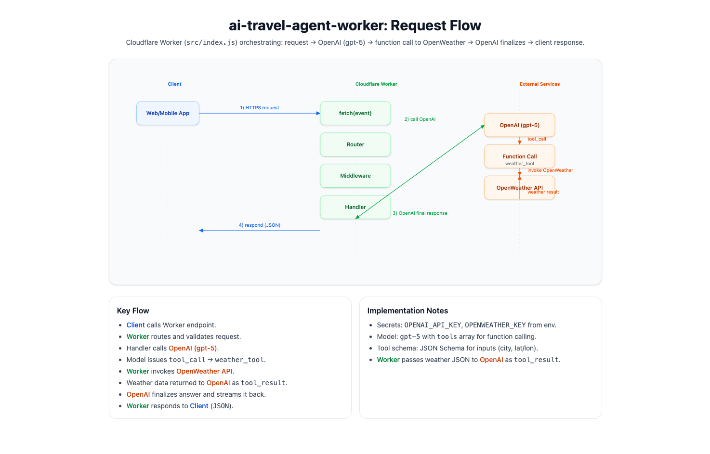

# AI Travel Agent — Cloudflare Worker

A lightweight Cloudflare Worker that powers an AI travel assistant—receive a user’s trip preferences, call LLMs and data sources, and return helpful plans and recommendations with snappy, edge-speed responses.

## Features

- ⚡️ Edge-native: Runs on Cloudflare Workers for low latency.
- 🧠 AI Orchestration: Calls an LLM to chat, plan itineraries, and answer travel questions.

## Request Flow Diagram

### Update

We encountered inconsistencies when pulling data from the OpenWeather API.
To improve reliability, we removed the integration and shifted more control to OpenAI, allowing it to handle the app’s data flow and returned results directly.
